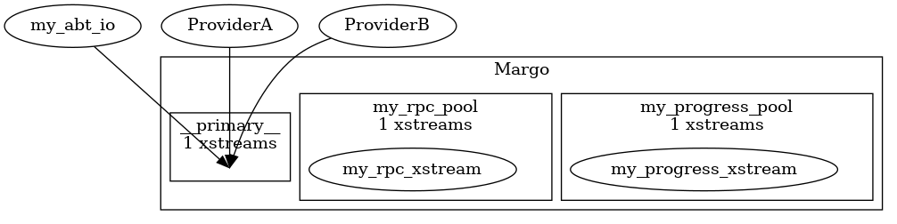

# mochi-json-viz

We use JSON in the Mochi project to describe the relationship between
components, and to allow us to capture all the configuration in a single file.
JSON is hard for me to stare at, though, so I thought a tool to depict the way
pools, streams, and services all interact would help.

For example, if you took [demo3.json](tests/demo3.json) and ran it through json-viz, you'd find an image like

- Argobots pools are boxes
- the xstreams drawing from that pool are inside those boxes
- the external ovals are other Mochi services.  We draw arrows showing the Argobots pool associated with those services.

## Installation

You'll need
* a C++ compiler
* nlohman-json
* graphviz if you want to turn the `dot` output into images

## Usage

Feed it a json file as the first argument.  It will spit out `dot` on stdout.  I like to pipe the output to `dotty` to make PNGs

    json-viz service.json | dot -Tpng > service.png
